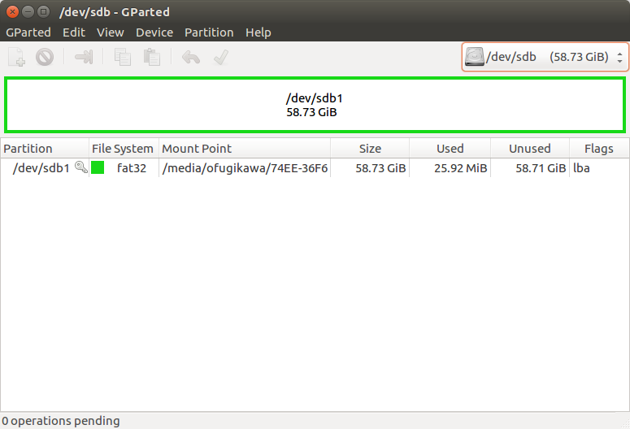

#### How To Set Up USB Swap for the roboRIO#### 
1) Plug in the tiny tiny USB stick to a Linux computer. 

2) Run in terminal:
sudo apt-get install gparted

3) Run in terminal:
sudo gparted

4) Change the hard drive you're modifying from /dev/sda to /dev/sdb (or something like that)

5) Right-click on the partition name and select "Unmount"

6) Right-click on the partition name and select "Delete"

7) Right-click on the partition name and select "New"
"Create as:" should be set to "Extended Partition"
Everything else, leave the same, and click "Add."

8) Right-click on the partition again and select "New" again.
Change the file system to "Linux swap" and change the New size (MiB) to 30071. 
Leave everything else the same and click "Add."

9) Right-click on the unallocated part of the partition and select "New"
Don't change anything. File system should be ext4 and Create as: should be set to Logical Partition.

10) Click the green check mark on the top of the window.
